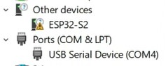

# ESP32S2Mini_OnOffLED-Example
- Program for ESP32-S2 Mini to switch on/off LED on board for every second.
- This project was made by PlatformIO on VS Code.
# First-time programing's guide
- Step 1: Connect to your PC via USB: Open Device Manager -> Connect your board -> If there is nothing shown up, press RST + GPIO0's button
 on the board then release -> On Device Manager will show 2 devices as shown in picture bellow.

  

- ~~Step 2: Make sure you have already installed CP210x Driver.~~ _Actually you don't need to do this step. I have confirmed that in my recent video [here](https://youtu.be/PTaIUJnYurg)_
- Step 3: Load the program to ESP32 for the first time: On VS Code (PlatformIO's Home Window), create the project with board: WEMOS LOLIN S2 Mini
-> Load the program to ESP32.
# Youtube
- This project's video can be seen at https://youtu.be/W2xYAuRxzlg
- Support my channel: @ElectricalThinking29
